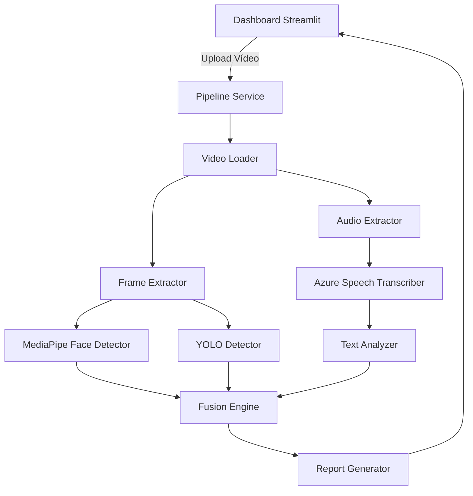

# Tech Challenge Fase 4: Sistema Multimodal de Análise de Vídeo


Este projeto consiste em uma plataforma de inteligência artificial de triagem e análise multimodal. Através da extração simultânea de áudio e vídeo de gravações brutas, a engine orquestra modelos de Visão Computacional (YOLOv8 e MediaPipe) e Processamento de Linguagem Natural (Azure AI Speech) para detectar comportamentos físicos, analisar a entonação da voz e realizar análise semântica da transcrição, gerando relatórios de risco automáticos.

---

## Funcionalidades

- ✔ **Upload de vídeo**: Interface limpa e minimalista via Streamlit.
- ✔ **Extração de áudio e frames**: Processamento assíncrono para separar metadados.
- ✔ **Detecção facial**: Rastreamento de landmarks via MediaPipe.
- ✔ **Transcrição**: Consumo da API Azure Cognitive Speech.
- ✔ **Análise textual**: Processamento de palavras-chave, polaridade e sentimento via NLTK/TextBlob.
- ✔ **YOLO**: Detecção customizada de objetos (ex: mãos no rosto) e posturas defensivas.
- ✔ **Fusão multimodal (Fusion Engine)**: Correlação de dados de áudio, texto e visão para definir um Score final de risco.
- ✔ **Dashboard Streamlit**: Visualização em tempo real das etapas.
- ✔ **Relatórios**: Geração de saídas consolidadas em JSON e Markdown.
- ✔ **Alerta à equipe médica**: Encaminhamento por e-mail SMTP, com registro simulado auditável quando não configurado.

---

## Arquitetura

O sistema adota uma arquitetura em camadas e arquitetura adaptadora, garantindo que as chamadas a serviços externos (como Azure e Ultralytics) sejam estritamente isoladas do domínio core (Fusion Engine).



---

## Tecnologias

- **Python** 3.11+
- **OpenCV** & **MoviePy**: Extração e manipulação multimidia.
- **MediaPipe**: Análise facial em tempo real.
- **YOLOv8 (Ultralytics)**: Object Detection de alta precisão.
- **Azure Cognitive Speech**: Speech-to-Text de ponta.
- **Streamlit**: Criação da interface interativa e minimalista.
- **PyTest**: Garantia de qualidade via TDD.

---

## Estrutura do Projeto

```
.
├── .github/          # Workflows do Github Actions e Templates
├── data/             # Datasets YOLO e vídeos de amostra
├── docs/             # Documentação técnica e da API
├── models/           # Pesos salvos (YOLO, MediaPipe)
├── outputs/          # Diretório onde relatórios e extrações são salvos
├── scripts/          # Utilitários secundários
├── src/
│   ├── audio/        # Serviços de Azure e extração
│   ├── domain/       # Entidades principais e interfaces Pydantic/Dataclasses
│   ├── fusion/       # Motor de inferência (Score e Regras)
│   ├── report/       # Formatação de saídas
│   ├── services/     # Orquestração do fluxo e Dashboard
│   ├── text/         # Análise de sentimento e NLP
│   ├── ui/           # Componentes modulares do Streamlit
│   └── video/        # Integrações OpenCV/Ultralytics
├── tests/            # Testes unitários de todas as camadas
├── app.py            # Entrypoint do Dashboard
└── main.py           # Entrypoint da CLI
```

---

## Instalação

```bash
# 1. Clone o repositório
git clone https://github.com/herbertsilva2/techchallenge4.git
cd techchallenge4

# 2. Crie e ative o ambiente virtual
python -m venv .venv
source .venv/bin/activate  # MacOS/Linux
# .venv\Scripts\activate   # Windows

# 3. Instale as dependências
pip install -r requirements.txt
```

---

## Execução

O projeto conta com dois formatos de uso.

### Executar como Dashboard (Recomendado)
```bash
streamlit run app.py
```
> O Dashboard estará disponível em `http://localhost:8501`.

> **Configuração local obrigatória:** antes de executar, crie o arquivo `.env.local` na raiz do projeto. Ele guarda as credenciais locais (Azure e SMTP) e não é versionado. Use `.env.example` como referência; sem as credenciais SMTP, os alertas serão registrados em modo simulado.

### Executar via CLI
```bash
python main.py data/samples/test_video.mp4
```

---

## Treinamento Rápido do YOLO Customizado

O dataset customizado usa as classes `hand_on_face` e `sharp_object`, configuradas em `data/yolo_dataset/dataset.yaml`.

Validar o dataset:
```bash
source .venv/bin/activate
python scripts/validate_yolo_dataset.py
```

Treinar o modelo:
```bash
python scripts/train_yolo_custom.py \
  --data data/yolo_dataset/dataset.yaml \
  --base-model yolov8n.pt \
  --epochs 50 \
  --imgsz 640 \
  --batch 8 \
  --name hand_safety_yolov8n
```

Copiar o melhor modelo para o caminho usado pela aplicação:
```bash
mkdir -p models/yolo
cp runs/detect/hand_safety_yolov8n/weights/best.pt models/yolo/best.pt
```

Executar o dashboard com o modelo treinado:
```bash
streamlit run app.py
```

---

## Testes

Garantimos a integridade do código utilizando `pytest`. Para testar toda a aplicação:
```bash
pytest
```

---

## Alerta por e-mail

Ao concluir cada análise, o sistema encaminha um e-mail de apoio à triagem com nível de risco, evidências, recomendações e transcrição. Configure um servidor SMTP no arquivo `.env.local` (use `.env.example` como modelo). Para Gmail, use uma senha de aplicativo; nunca use nem versione a senha da conta. O `.env.local` é ignorado pelo Git.

Crie o arquivo na raiz do repositório antes da execução local:

```bash
cp .env.example .env.local
```

Preencha nele somente as variáveis necessárias ao seu ambiente. Não coloque credenciais no `.env`, pois esse arquivo já é rastreado pelo repositório.

Sem as variáveis SMTP, o envio é simulado e salvo em `outputs/alerts/`. O dashboard, o relatório JSON e o Markdown exibem o status `sent`, `simulated` ou `failed`, permitindo demonstrar o fluxo de encaminhamento.

## Detecção de objeto cortante

O detector usa o limite geral de confiança `0,25`, mas aceita candidatos `sharp_object` a partir de `YOLO_SHARP_OBJECT_MIN_CONFIDENCE=0.10`. Um objeto cortante só é registrado como evidência de risco quando aparece em ao menos 2 dos últimos 3 frames analisados. Esse ajuste favorece objetos pequenos ou parcialmente ocultos, mas continua exigindo revisão humana e não substitui o retreinamento com imagens representativas.

---

## Evidências e Telas


*(Placeholder: insira aqui os prints do seu dashboard estilo Apple).*

---

## Roadmap

- [x] Concepção da Arquitetura Core e Modelagem de Domínio
- [x] Integração Básica de Vídeo (MediaPipe/OpenCV)
- [x] Integração de Nuvem (Azure Speech)
- [x] Construção do Dashboard Interativo MVP
- [x] Profissionalização Open-Source (Actions, PR Templates, Tests)
- [ ] Treinamento completo do YOLOv8 customizado para classes de saúde
- [ ] Deploy serverless / conteinerizado (Docker)
- [ ] Construção de uma REST API (FastAPI) para processamento Headless

---

## Limitações

- A análise de sentimentos e a inferência baseada em texto estão ajustadas primariamente para o idioma `pt-BR`.
- Modelos customizados YOLO (`best.pt`) requerem hardware acelerado (GPU) para treinamento, e este repositório possui apenas o scaffold.

## Dataset e treinamento YOLO

O processo de coleta ética, anotação e revisão para a classe `hand_on_face` está documentado em [docs/coleta_e_anotacao_yolo.md](docs/coleta_e_anotacao_yolo.md). Depois de preencher o dataset, valide e treine com:

```bash
python scripts/validate_yolo_dataset.py
python scripts/train_yolo.py --device 0
```

O script copia o melhor peso treinado para `models/yolo/best.pt`, caminho carregado automaticamente pelo pipeline. Em computadores sem GPU, use `--device cpu` para um experimento menor; para a entrega final, registre as métricas de validação e teste geradas pelo Ultralytics.

---

## Próximos Passos
As prioridades para as próximas atualizações menores envolvem o **Treinamento YOLO** em instâncias na nuvem, criação de **Dockerfiles** padronizados para isolamento completo e implementação de uma camada de **API REST** para facilitar integrações b2b.
