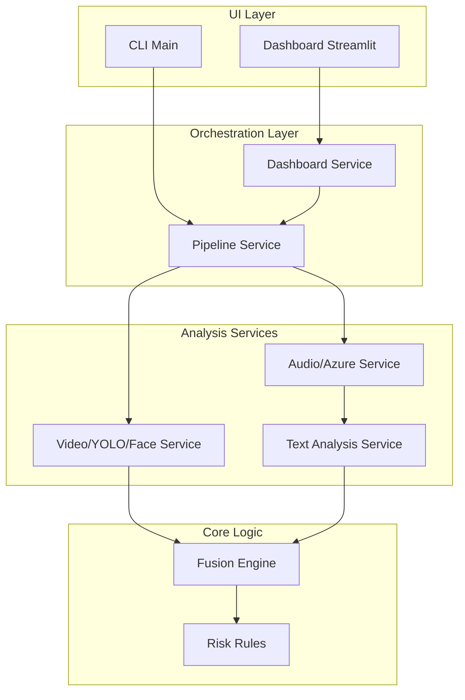

# Documentação de Arquitetura

Este documento descreve a organização de alto nível do sistema Tech Challenge Fase 4.

## Diagrama de Componentes

O sistema adota uma separação de responsabilidades inspirada em Clean Architecture, onde os processos de extração pesada operam na borda e reportam para os modelos de domínio imutáveis no núcleo (Fusion Engine).

## Decisões de Design
1. **Isolamento de Nuvem**: Todas as requisições ao Azure Speech estão confinadas ao `azure_speech_transcriber.py`.
2. **Interfaces Únicas**: Módulos de detecção gráfica não conhecem texto, o `Fusion Engine` é o único a conhecer ambos.
