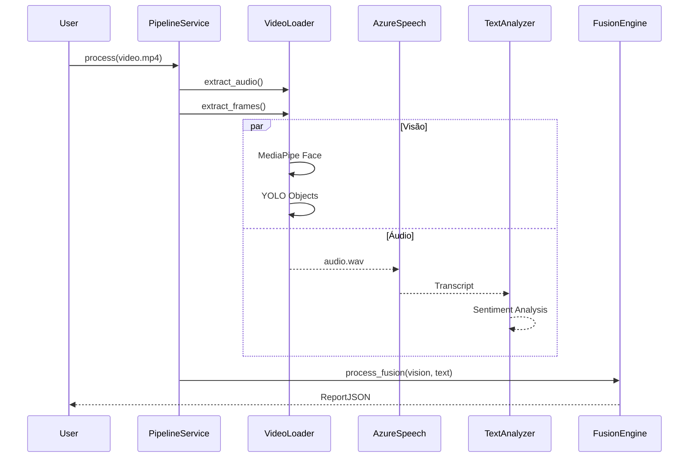

# Documentação do Pipeline Multimodal

O Pipeline Multimodal é responsável pelo processamento assíncrono dos artefatos (vídeo) de ponta a ponta.

## Fluxo de Processamento

## Etapas de Falha
Se a API Azure estiver inacessível, o status do componente transcrição entra em `failed` (ou usa um fallback) mas o Pipeline continua a execução da visão de forma isolada, gerando um relatório em modo *PARTIAL*.
